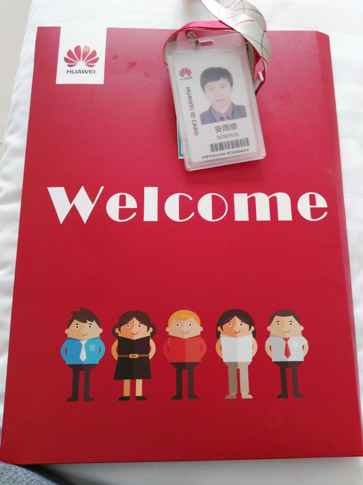
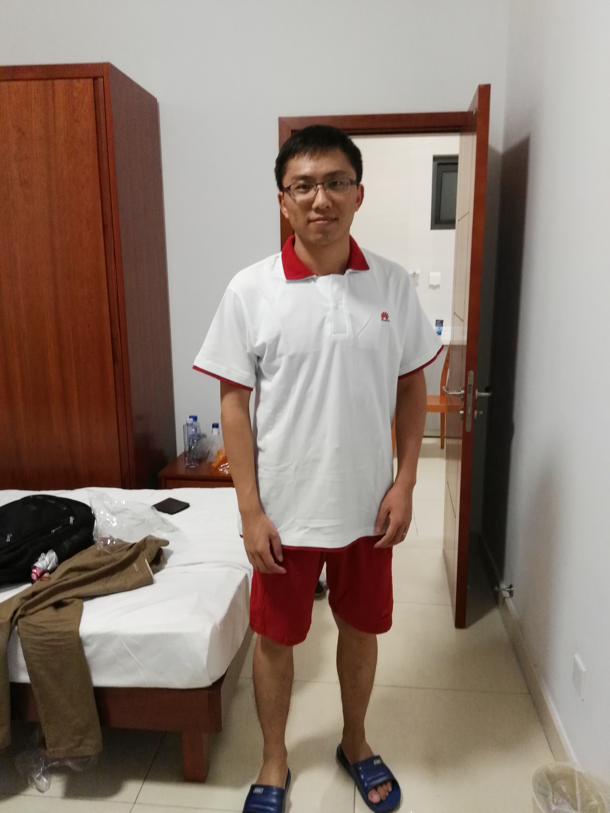

# 新员工入职培训
华为的入职流程非常之规范，用一句话概括就是：“被安排的明明白白的”，此处是褒义词，不是网络用语的贬义词，今天就来聊一下华为正规的新员工入职培训，按照先后顺序一一展开
## 确定报到时间
在接受offer之后，会受到选择报到时间的邮件，有一系列时间供你选择，但不能到每天，一般是每周一批，如果是跳槽高峰期或者应届生入职时间，最近的几批肯定都人满为患，我选择的时间是2016年10月17日
## 报到
选择报到时间后，会统一安排入职培训场地、住宿、一辆只为你而来的出租车

下车之后，只用跟着路标一路向前，没有路标的地方便是报到处，礼仪小姐都像空姐一样，个高腿长肤白貌美，要在现在全都得叫小姐姐，但那时候还没有“小姐姐”一词，就勉为其难叫美女

从现在开始，可能会出现很多图片（先把“小姐姐”放一放，不会是小姐姐的照片，是本人拍的一些有纪念意义的照片），帮助我更加生动形象的讲述那段经历，让我们先来看第一张：入职材料和个人工卡

我拿到图中材料的时候手有一些抖，激动的很想立即拍照发一条朋友圈，自豪感都快从身上的每一个毛孔喷涌而出，但一个不太自信的念头快速的压制了我的这个想法，我决定先忍一忍，等体检报告出来确认没问题之后再发，第一天除了办理报到手续就没有其他事情了，在宿舍认识下室友，聊聊天，安静的等待第二天的体检

## 体检
体检项目很多，从里到外，从上到下基本查了个遍，对于青涩的我来说，检查生殖器让我着实有那么一丢丢尴尬（此处无图可看），同期报到的人很多，体检排队很长，有刚毕业看起来很青涩的小伙儿，也有满头白发的“大哥”，中午弄到比较晚才吃饭，饿得发慌

体检完成，又是无事的一天，回到宿舍跟室友聊天，聊未来岗位，聊个人爱好等，天南海北，乱吹一通

体检报告要第二天才出，是一个煎熬等待的晚上就对了，毕竟体检报告出来就可以发朋友圈了~

体检报告没有因为我的焦急等待而提前到来，中午出去吃饭的路上还听到有人在讨论，有人收到短信要求复查，有心脏问题的，有血压问题的，也有肺部问题的，吓得我在心里双手合十念到：上天保佑我一切正常，阿弥陀佛

终于我收到短信了，有一点不痛不痒的问题：窦性心律不齐+过缓，近视；不需要复查

我终究还是没有发这条朋友圈，可能是过了那时候，没有那个劲儿了

没有朋友圈，补一张宿舍个人照吧

## 新员工入职培训
兜兜转转半天，终于说到题目了，而这一段我却想用很少的文字来描述

时间太晚，该睡觉了，暂存~