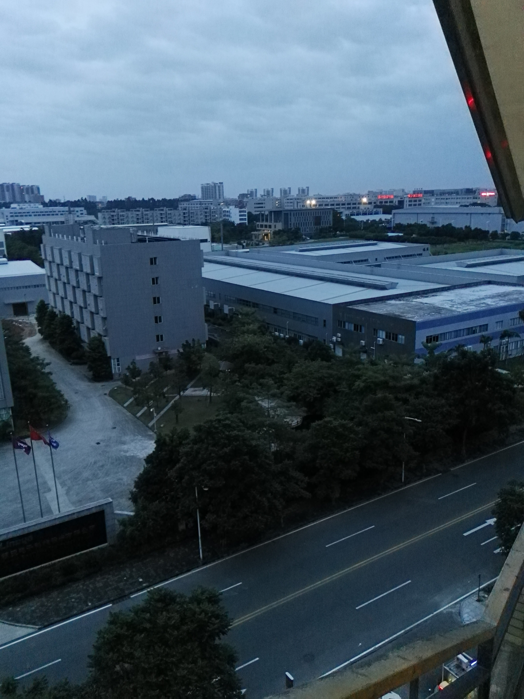

# 新员工入职培训
华为的入职流程非常之规范，用一句话概括就是：“被安排的明明白白的”，此处是褒义词，不是网络用语的贬义词，今天就来聊一下我在华为的新员工入职培训
## 确定报到时间
在接受offer之后，会收到选择报到时间的邮件，打开邮件中的链接，可以看到一系列的时间可供选择，一般是每周一批，如果是跳槽高峰期或者应届生入职时间，最近的几批肯定都人满为患，根据各方考量，我最终选择的时间是2016年10月17日
## 报到
确定报到时间后，公司会统一安排培训场地、培训期间住宿、还有一辆出租车送你到最近的班车上车点

下车之后，只用跟着路标一路向前，路标的尽头就是报到处，高档的报到处有很多礼仪小姐，个个空姐一样，个高腿长肤白貌美，用现在的叫法都是小姐姐，但那时候还没有“小姐姐”，我们都叫“美女”，在美女的指引下，开启了我的华为之旅，不失为一件值得开心的事情

从现在开始，可能会出现很多图片（不要多想，肯定不会是小姐姐的照片，是本人拍的一些有纪念意义的照片），帮助我更加生动形象的讲述那段经历，让我们先来看第一张：入职材料和个人工卡

我拿到图中材料的时候手有一些抖，激动的很想立即拍照发一条朋友圈，自豪感都快从身上的每一个毛孔喷涌而出，但一个不太自信的念头快速的压制了我的这个想法，我决定先忍一忍，等体检报告出来确认没问题之后再发。

第一天除了办理报到手续就没有其他事情了，在宿舍认识下室友，聊聊天，安静的等待第二天的体检

## 体检
入职体检的检查项目很多，从里到外，从上到下基本查了个遍，对于青涩的我来说，检查生殖器让我着实有那么一丢丢尴尬（此处无图可看），同期报到的人很多，体检排队很长，有刚毕业看起来很青涩的小伙儿，也有满头白发的“大哥”。因为队伍很长外加自己排队调度算法不够好，中午弄到比较晚才吃饭，饿得两腿发抖

体检完成，又是无所事事的一天，回到宿舍跟室友聊天，聊未来岗位，聊个人爱好等，天南海北，乱吹一通

体检报告要第二天才出，是一个煎熬等待的晚上无疑了，毕竟体检报告出来就可以发朋友圈了~

体检报告没有因为我的焦急等待而提前到来，中午出去吃饭的路上还听到有人在讨论，有人收到短信要求复查，有心脏问题的，有血压问题的，也有肺部问题的，吓得我在心里双手合十念到：上天保佑我一切正常，阿弥陀佛

终于我收到短信了，有一点不痛不痒的问题：窦性心律不齐+过缓，近视；不需要复查

我终究还是没有发这条朋友圈，可能是过了那时候，没有那个劲儿了

没有朋友圈，补一张宿舍个人照吧

## 新员工入职培训
兜兜转转半天，终于说到题目了，而这一段我却想用很少的文字来描述

培训的主要目的是了解华为公司，包括公司的经营范围，文化，使命，以及一些规章制度等等

为了达到上述目的，课程是经过精心设计的，从各个方面新兵们快速融入华为大家庭，可能会让大家感到意外的是：需要在天亮之前起来跑操，类似大学军训，不过大学军训需要一个月，而华为入职培训只有三天左右时间

下图是跑操前早晨的南方公寓：

培训期间一个班级会分成多个组，组内合作，组间竞争，有一个环节是给你认为优秀的同事写明信片，每天有几张，在墙上摆着同事们的名字，每个名字下方是可以放很多明信片的袋子，我每天都会犹豫要不要给自己写一张，避免一张都没有的尴尬事情发生，经过激烈的内心斗争，我还是给自己写了一张，到培训结束的时候，每个人都拿到了自己的袋子，我的袋子里也有不少明信片，这是意外的惊喜，所以至今我都还保留着

如图：

